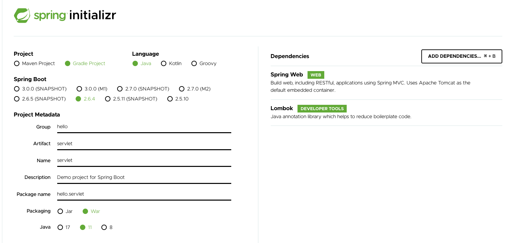
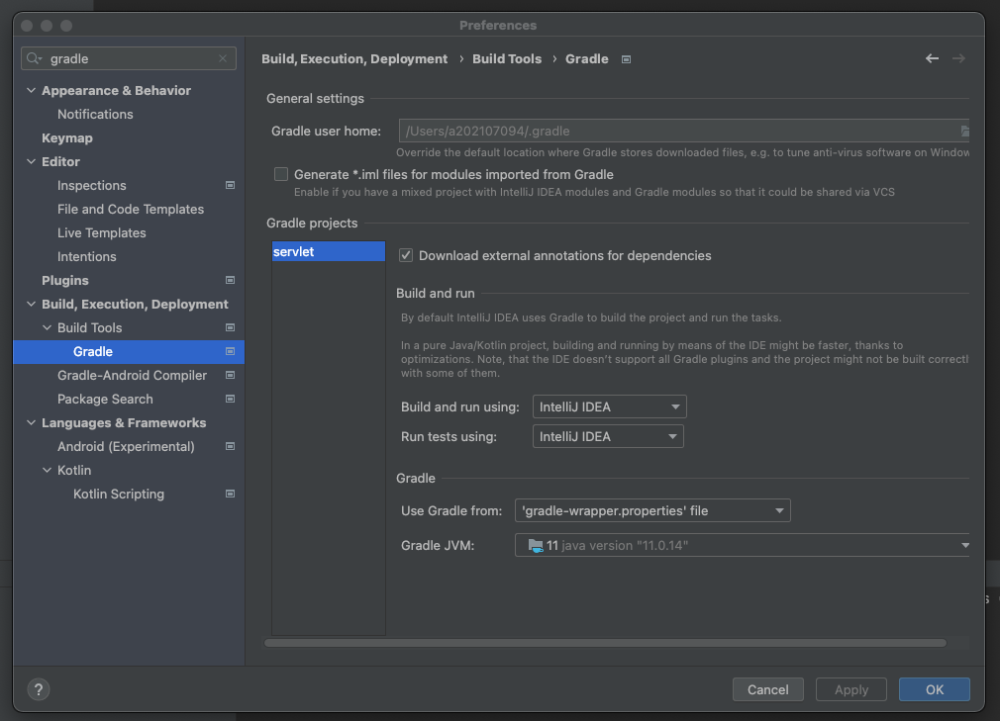
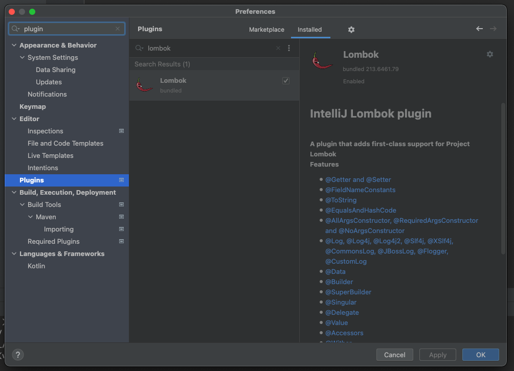
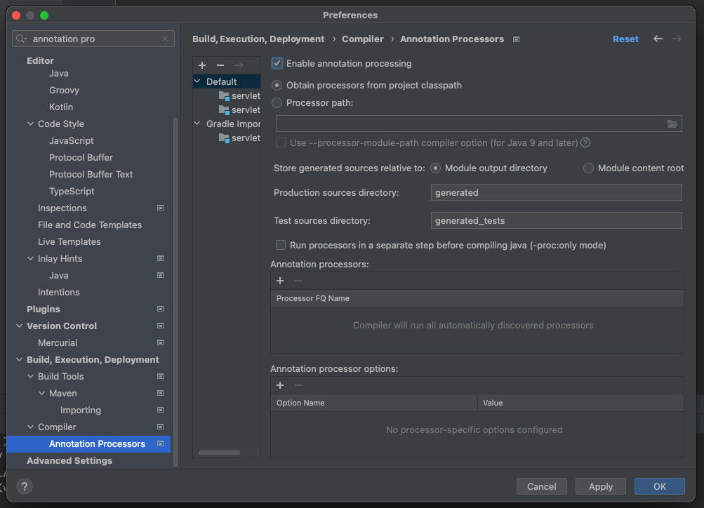

# 02. 서블릿

## 프로젝트 생성

### 프로젝트 생성

스프링 프로젝트를 생성한다.

Packaging은 JSP를 실행하기 위해 Jar가 아닌 War를 선택한다.

### 프로젝트 설정

IntelliJ Gradle 대신에 자바를 직접 실행하도록 설정을 변경한다.

Gradle보다 자바로 바로 실행하면 실행속도가 더 빠르다.

롬복 적용하고 잘 동작하는지 확인한다.

### postman 설치

postman을 설치한다.

## Hello 서블릿

